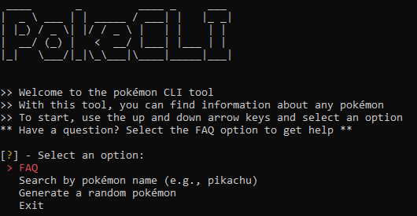
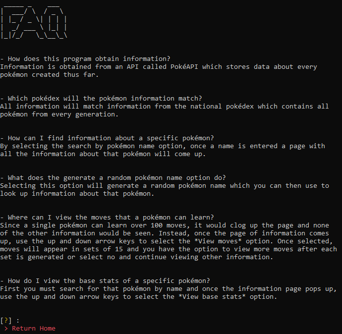
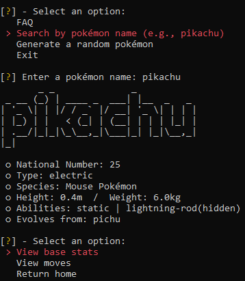
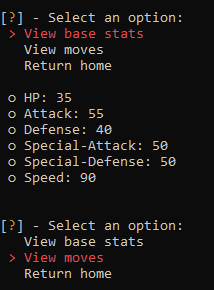
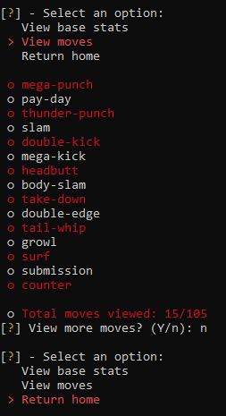
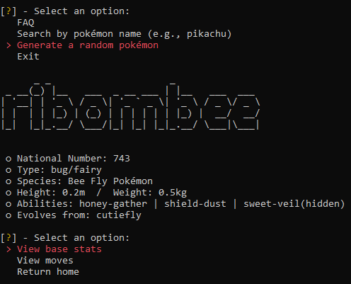
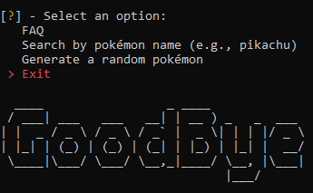

# PokéCLI

PokéCLI is a command-line interface tool that provides information about all the pokémon in the pokédex. This information is obtained using [PokéAPI](https://pokeapi.co/), a RESTful API that contains all the information of every pokémon. It acts similarly to a pokédex in that the user can enter a pokémon's name and view information about them. The options available when using this program are: FAQ, Search by pokémon name, Generate a random pokémon, View base stats, View moves, Return home, Exit.

Generate a random pokémon is a special function that uses a microservice `prng.py` to generate a random number that correlates to a pokémon's national pokédex number and uses that to obtain information on that pokémon.

## How to Use
- Open a terminal and cd to where files are located.
- In terminal, run `python main.py`
- In a second terminal, run `python prng.py`
- Use up and down arrow keys + enter to select an option
  - The option currently highlighted in red is the option the user is on

## Screenshots

<figcaption>Opening Screen</figcaption>

<figcaption>FAQ</figcaption>

<figcaption>Search Option</figcaption>

<figcaption>View Base Stats</figcaption>

<figcaption>View Moves</figcaption>

<figcaption>Random Option</figcaption>

<figcaption>Goodbye Screen</figcaption>

